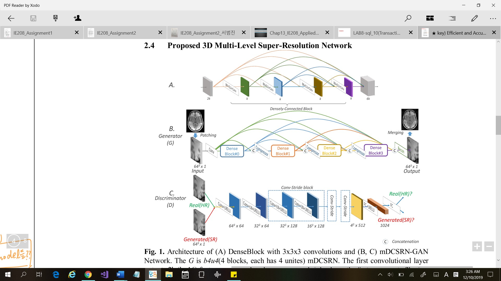

# 2019-2H ML project - MRI Brain Image Super Resolution

### Reference 
* 	Huixiang Zhuang hz2538@COLUMBIA.EDU
>https://github.com/hz2538

### Getting Started
These instructions will provide you a guideline for our basic functions as well as how to running on your machine for development and testing purposes.

### Description 
The objective is to create a network that can take a low-resolution MRI scan and turn it into a super resolution scan.

This repo aims at reproducing the results of the paper https://arxiv.org/abs/1803.01417. The network architecture is shown below:

mainly I tried 

1. Data Augmentation method  
I had to make Low Resolution image data for input data. I tried fftshift filter, Gausian filter and mixing some filters and so on. What I choose as the best method is taking fft and inverse fftshift with random coefficient and bigger zeroing size (i.e. in this model, 160)

2. Decreasing number of paparameters  
I tried to decrease number of parameters of discriminator. What I use method is replacing 3x3 CONV by 1x1 CONV and fully-connected layers by global average pooling. I decreased the number of paramrters from 31.156M to 17.629M. 

3. Gradient Penalty  
I used Gradient Penalty term to Wasserstein-GAN. Since It is replaced with weight clipping, I assumed this trem will help to get better performance.   

### Dataset
The dataset is a large and publicly accessible brain structural MRI database called Human Connectome Project (HCP): https://www.humanconnectomeproject.org. The data contains 3D
T1-weighted images from a total of 1,113 subjects that were acquired via a Siemens 3T platform using 32-channel head coils on multiple centers. The images come in high spatial resolution as 0.7 mm isotropic in a matrix size of 256x320x320. You need to register and log in the website: https://db.humanconnectome.org. You can either download full dataset from that website or request access to their Amazon S3.

`pip install numpy matplotlib scipy nibabel pandas skimage`

See full details of the environment requirements in *requirements.txt*.

### Introducing the files in project

    |-- data_prep
        |-- CSV_reader.ipynb
        |-- DataProvider.py
        |-- LRbyFFT.ipynb
        |-- idx_mine.mat
        |-- nii2npy.ipynb
        |-- patchloader.py
    |-- my_models 
        |-- mdcsrn_fragment.py    
    |-- result
        |-- eval_metrics.pt
    |-- main.ipynb
    |-- training_pre_.py
    |-- wgan_gp_v3.py    
    |-- README.md
